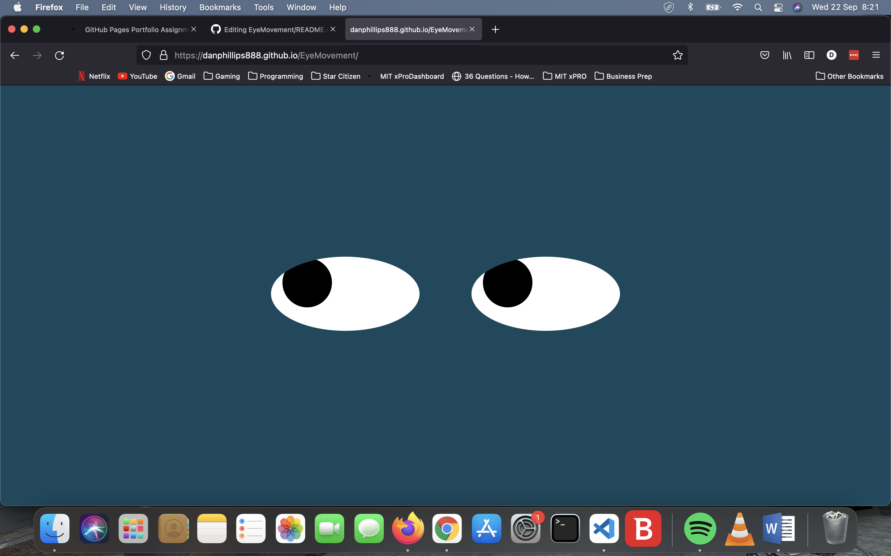

# EyeMovement

A fun mouse cursor tracking eye animation from Week 8 of the xPro full dev course 

## Run Instructions: 
Copy the three files eyes.js, index.html and styles.css to the same folder on your harddrive. Then drag and drop the idex.html file onto your web browser.

## Future Developments: 
I would like to implement a bit more detail like a head, hair, ears, nose, mouth and make a full mouse watching face.

## Licence: 
MIT Licence arranged through the MITxPro Emeritus Full stack Dev course.
